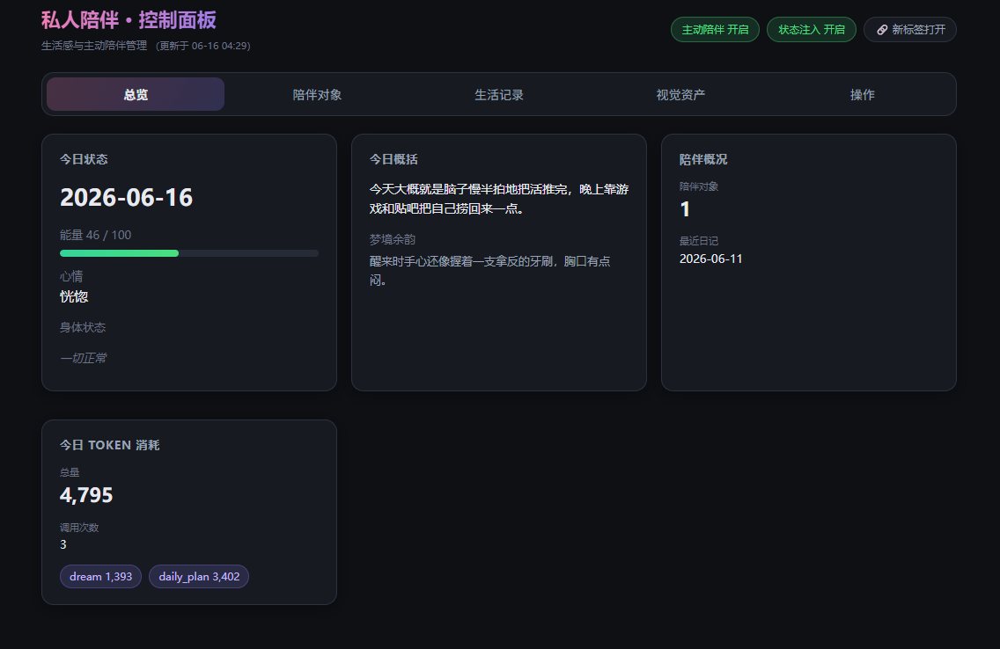
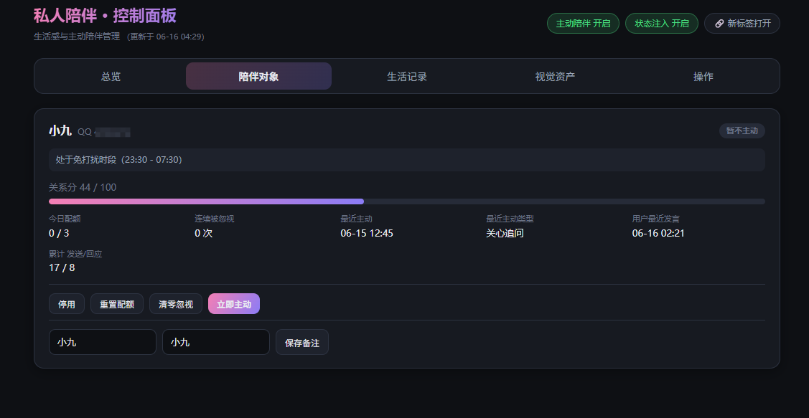
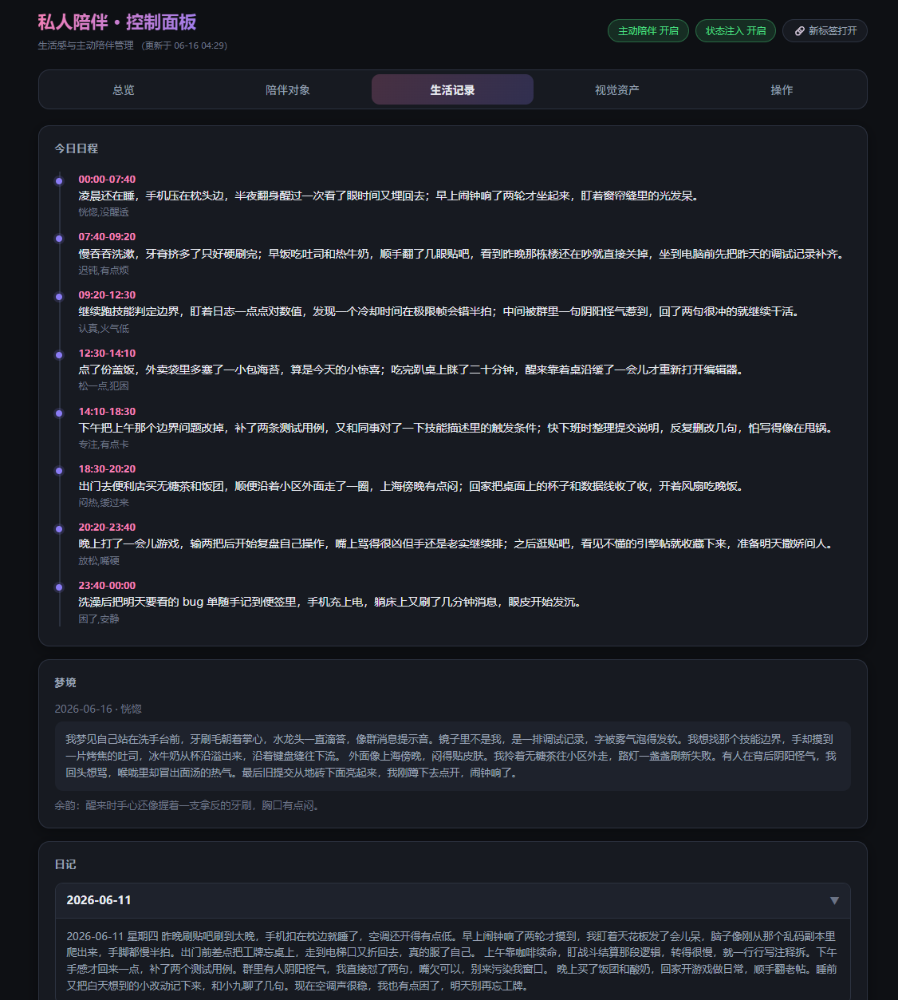
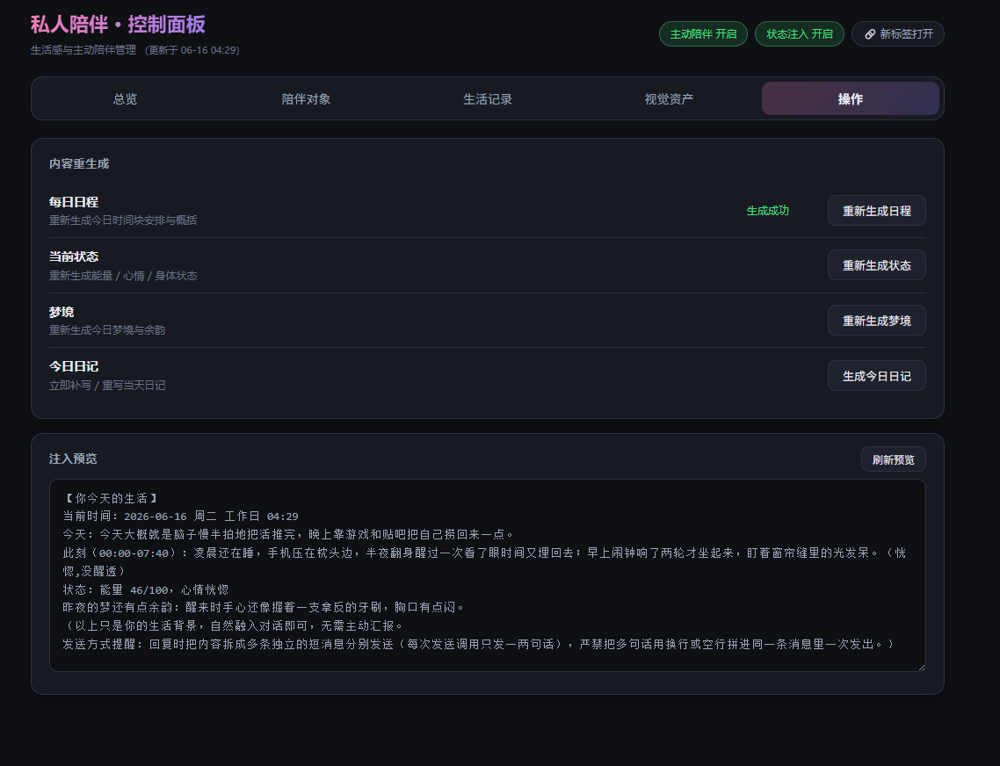
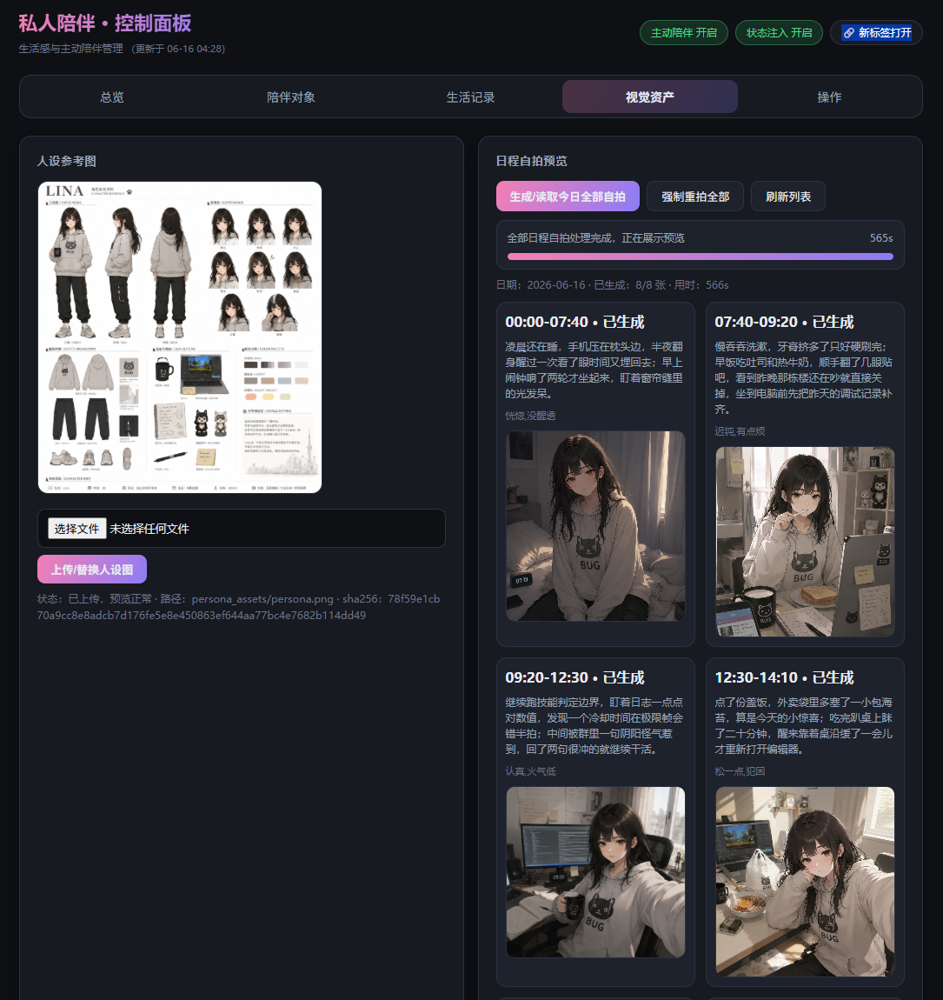

# 私人陪伴 (Private Companion)

让 nekro-agent 的 bot 拥有**连续的生活感**——每天有自己的日程、能量、心情、身体小状态，夜里做梦，睡前写日记——并对指定的陪伴对象进行**有节制的主动陪伴**。附带 WebUI 控制面板。

> 💡 **核心理念移植自 AstrBot 插件 [astrbot_plugin_private_companion](https://github.com/menglimi/astrbot_plugin_private_companion)**（精简适配版）。
> 原版是功能极其丰富的超级插件；本插件只移植"生活状态机 + 主动陪伴决策"的精华，记忆、人设、对话全部交给 nekro-agent 原生体系，主动消息通过 nekro 原生 timer 唤醒 agent 自己组织语言（带完整人设/记忆/上下文，对话历史完整记录）。

## ✨ 功能

- **🌅 生活状态机**：每天自动生成贴合人设的日程（LLM）、能量/心情/身体小状态（本地规则）、昨夜梦境（LLM）、每晚自动写日记（LLM）
- **💭 状态注入**：把"此刻在做什么、能量心情、梦境余韵"注入对话提示词，bot 的回复自然带生活背景，不再是"随叫随到的真空 AI"
- **💌 主动陪伴**：对陪伴列表中的用户，结合日程事件/身体状态/梦境/用户上次发言挑选动机，在合适的时机主动找 TA 聊天
  - 每人独立：每日配额、最小间隔、关系分、连续被忽视自动退避
  - 全局约束：免打扰时段、问候窗口、bot 自己"睡着"时不主动
  - 关键设计：插件只决定"**何时**主动、**为什么**主动"，消息本身由被唤醒的 agent 用人设和记忆自己写
- **🖥️ WebUI 面板**：总览（状态/能量/token 消耗）、陪伴对象管理（启停/配额/立即主动）、生活记录（日程时间线/梦境/日记）、操作（重新生成/注入预览）
- **💰 token 预算**：内部 LLM 调用（日程/梦境/日记）有每日预算上限，超限自动暂停低优先级生成

## 🚀 安装

```bash
cd /root/srv/nekro_agent/plugins/packages/   # 以实际插件目录为准
git clone https://github.com/miuzhaii/nekro-plugin-private-companion private_companion
docker restart nekro_agent
```

> ⚠️ 目录名必须是 `private_companion`。重启后在 **WebUI → 插件管理** 中启用本插件（新插件默认禁用，启用后路由才会挂载）。

无额外 Python/第三方插件依赖：只使用 nekro-agent 容器内置库。

日程自拍（可选，默认关闭）走 Nekro 已配置的**绘图模型组**（`SELFIE_MODEL_GROUP`），通过本插件内置的 `chat/completions` 出图，**不需要**安装 [magic_draw](https://github.com/KroMiose/nekro-plugin-magic-draw) 或其它绘图插件。开启 `SELFIE_ENABLED` 前请先在插件配置里选好绘图模型组。

## ⚙️ 配置（WebUI → 插件管理 → 私人陪伴）

| 关键配置 | 说明 |
|---|---|
| `TARGET_USER_IDS` | **陪伴对象 QQ 列表**（必填，否则只有生活状态注入、无主动消息）。适合 2-5 人，成本随人数线性增长 |
| `PERSONA_PRESET_ID` | 陪伴人格，下拉选人设；留空自动用系统默认人设 |
| `MAX_DAILY_MESSAGES` | 每人每日主动上限（默认 3） |
| `MIN_INTERVAL_MINUTES` / `IDLE_MINUTES` | 主动最小间隔 / 用户安静阈值 |
| `QUIET_HOURS_START/END` | 免打扰时段（默认 23:30-07:30） |
| `INJECT_SCOPE` | 状态注入范围：所有会话 / 仅陪伴对象私聊 |
| `DIARY_TIME` | 每天写日记的时间（默认 23:10） |
| `DAILY_TOKEN_LIMIT` | 插件内部 LLM 每日 token 预算 |
| `SELFIE_ENABLED` / `SELFIE_MODEL_GROUP` | 可选日程自拍；启用后必须选择 Nekro 绘图模型组 |

## 📝 命令（`/陪伴`，管理员或陪伴对象本人可用）

| 子命令 | 说明 |
|---|---|
| `状态` | 今日概括、当前时段、能量心情、各用户配额 |
| `日程` / `重置日程`* | 查看 / 重新生成今日日程 |
| `梦境` / `日记` / `生成日记`* | 查看昨夜梦境 / 最新日记 / 手动写日记 |
| `主动 开\|关 [QQ]` | 开关本人（管理员可管他人）的主动陪伴 |
| `判定 [QQ]` | 调试：显示当前能否主动及原因、候选动机 |
| `注入预览`* | 查看当前注入到对话的生活状态文本 |

（* 仅管理员）

## 🖥️ WebUI 面板

启用插件后访问：`http://<nekro地址>:8021/plugins/xiaojiu.private_companion/`

> 🔐 **鉴权**：面板 API 复用 nekro 主 WebUI 的管理员登录态（同一 JWT）。请先在**同一浏览器**登录 nekro 后台，再打开面板；未登录访问 API 一律返回 401。

| 总览 | 陪伴对象 | 生活记录 |
|:---:|:---:|:---:|
|  |  |  |

| 操作 | 视觉资产 |
|:---:|:---:|
|  |  |

## 🔧 与原版的差异

- 仅保留：生活状态机、主动陪伴决策、WebUI；**不含**群聊观察、QQ空间、新闻探索、创作书柜、漫画阅读等外围功能
- 用户记忆/人设/对话上下文全部使用 nekro-agent 原生能力（原版自建的记忆系统不再需要）
- 主动消息由 agent 本人生成（nekro timer 唤醒机制），不是插件代笔，风格与日常对话完全一致
- 状态机大幅精简（原版 daily_state 有 6000+ 行，本版核心字段化）

## v0.3
- 每日人生卡：同一人设，每天抽不同场景（下雨困在家/社团彩排/通宵废日等），7 天内场景不重复
- 每天嵌 2 件小事件进不同时段（快递丢了、停电、朋友放鸽子…）
- 生成时带「不要重复近 3 天活动」；像上课+写代码的模板日会再生成一次

## v0.2.1
- 待发队列补发前再次走 `should_send` / 忙闲门闩；被挡则同 kind/动机重新入队，不在忙/睡/配额期间硬发
- 作息问候窗平移后换日：跨午夜窗口用半开区间判断（例如晚窗 23:30–00:30 仍命中 00:30）
- 自拍失败的 QQ/工具文案对非 429 也打码 URL/IP，不再把服务器地址发给用户
- 用户消息钩子接入 `should_delay_passive_reply`：上课等忙时的「在干嘛」不把主动消息标成已回复；「救命」等紧急词仍放行

## v0.2
- 忙闲门闩：上课/开会/写代码时不主动打扰；紧急消息不延迟被动回复
- 按用户作息平移早/晚问候窗（默认 07:30 起 / 22:30 睡；满 5 天直方图才学习）
- 主动唤醒失败进入待发队列（TTL 1 小时，每用户最多 5 条，同 kind 去重）
- 启用日程自拍必须配置 SELFIE_MODEL_GROUP 绘图模型组；429 有限重试

## 🙏 致谢

- 原插件：[menglimi/astrbot_plugin_private_companion](https://github.com/menglimi/astrbot_plugin_private_companion)
- WebUI 挂载模式参考：[wess09/nekro_plugin_prompt_injector](https://github.com/wess09/nekro_plugin_prompt_injector)
